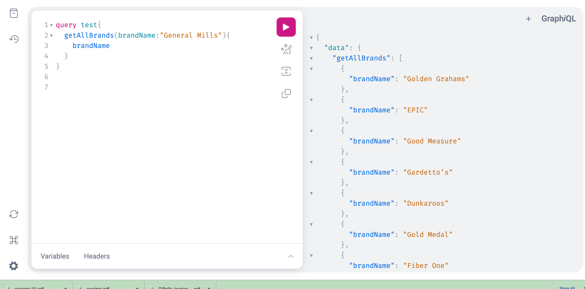
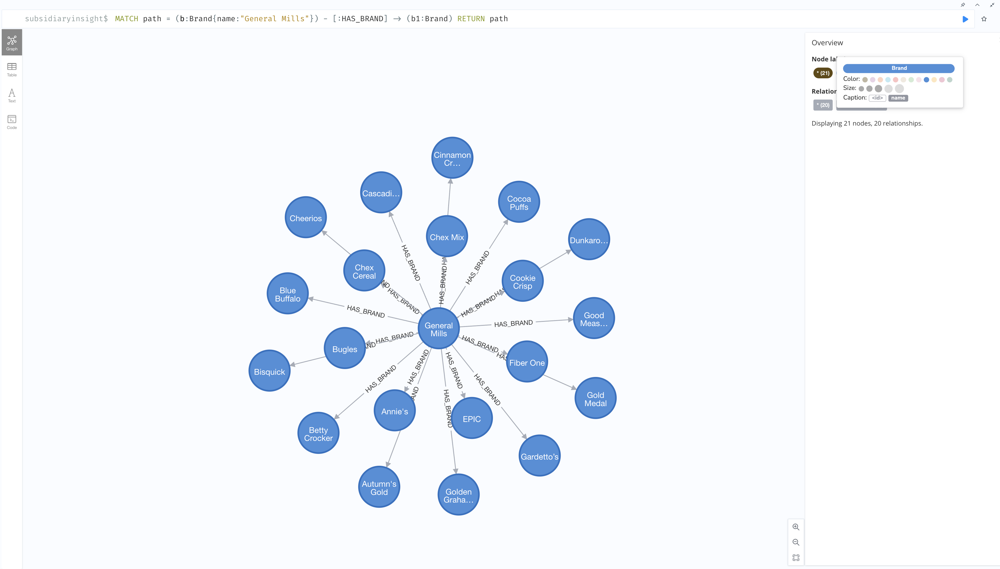

### Subsidiary Application:

### Use case

* Often it's difficult to understand all of the complex relationships between parent corporations, their subsidiaries and all of the products under their umbrellas of portfolios
* This application is an attempt to better comprehend what products we interact with in our daily lives

### Technologies

* Neo4j (Database)
* Spring Data Neo4j (API)
* Spring GraphQL (API)
* Beautiful Soup / Selenium (WebScraping)

to do: 

* React (Front End)
* Graph Data Science (to better understand clustering and similarities)
* AWS Comprehend (NLP to extract more insights out of unstructured data soruce)
* Expand webscraping to build a larger initial graph
* Host via AWS managed services

### Helpful documentation:

* GraphQL codegen : https://the-guild.dev/graphql/codegen/docs/getting-started/installation
* React and Spring Boot article: https://suaybsimsek58.medium.com/react-spring-boot-graphql-fullstack-microservice-application-on-kubernetes-eb227e1a748b

